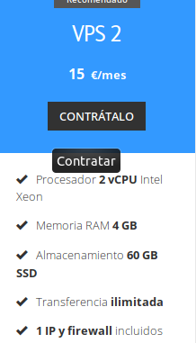
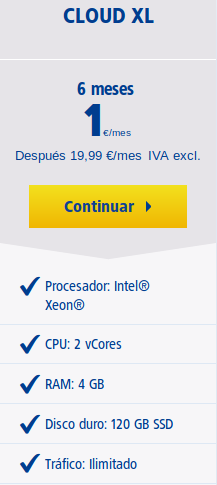
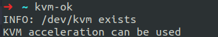

## Ejercicios Tema 1:

### Introducción a la infraestructura virtual: concepto y soporte físico

* * *

##### Ejercicio 1:

-   **Consultar en el catálogo de alguna tienda de informática el precio de un ordenador tipo servidor y calcular su coste de amortización a cuatro y siete años. Consultar este artículo en Infoautónomos sobre el tema.**

El coste de amortización sería para el [servidor](https://www.pccomponentes.com/hp-proliant-ml30-gen9-intel-xeon-e3-1220v68gb-reacondicionado), con el precio de 682€, calculando ganancias cada año por un 26% del precio del servidor:  

1.  Para cuatro años: Se gana 709,28€, por lo que el servidor estaría amortizado.
2.  Para siete años: Se gana 1241,24€,por lo que el servidor estaría amortizado también.

* * *

##### Ejercicio 2:

-   **Usando las tablas de precios de servicios de alojamiento en Internet “clásicos”, es decir, que ofrezcan Virtual Private Servers o servidores físicos, y de proveedores de servicios en la nube, comparar el coste durante un año de un ordenador con un procesador estándar (escogerlo de forma que sea el mismo tipo de procesador en los dos vendedores) y con el resto de las características similares (tamaño de disco duro equivalente a transferencia de disco duro) en el caso de que la infraestructura comprada se usa sólo el 1% o el 10% del tiempo.**

La mayoría de los servicios de VPS ofrecen más o menos estas especificaciones en el rango de 10-15 euros:

-   2 CPU Intel Xeon
-   4 GB de RAM
-   SSD de 50-60 GBs  

En cuanto a la transferencia, algunos ofrecen ilimitada y  otros ciertos TBs.

Ahora se realiza una comparación durante un año entre dos parecidos,  [Arsys](https://www.arsys.es/servidores/vps?s=cpc&c=316967523&a=19256490003&gclid=Cj0KCQjwof3cBRD9ARIsAP8x70O10ps4RIllV6Q8x0fOtW5oyPIL6LGfUAvmOPU6Zi7p6sQv0fOhGLkaAsz0EALw_wcB) y [1and1](https://www.1and1.es/servidores-virtuales?ac=OM.WE.WEo42K356292T7073a&gclid=Cj0KCQjwof3cBRD9ARIsAP8x70OaCiu79jxYIbv4_3YjbH8e7piWqiy3IXnTBZsPwoBlAxMfRxJ8DakaAtDKEALw_wcB&gclsrc=aw.ds) nos ofrecen respectivamente:  

Por lo que vemos que prácticamente ambos nos ofrecen lo mismo, aunque 1and1 es algo más caro debido a que ofrece más almacenamiento, ambos servicios ofrecen intel Xeon.  

Al año _Arsys_ nos costaría 180 euros y _1and1_ serían 240 euros.

* * *

##### Ejercicio 3:

-   **En general, cualquier ordenador con menos de 5 o 6 años tendrá estos flags. ¿Qué modelo de procesador es? ¿Qué aparece como salida de esa orden? Si usas una máquina virtual, ¿qué resultado da? ¿Y en una Raspberry Pi o, si tienes acceso, el procesador del móvil?**

Ejercicio 3

* * *

##### Ejercicio 4:

1.  **Comprobar si el núcleo instalado en tu ordenador contiene este módulo del kernel usando la orden kvm-ok.**
Lo contiene:

2.  **Instalar un hipervisor para gestionar máquinas virtuales, que más adelante se podrá usar en pruebas y ejercicios.**  

  [Instalamos un hipervisor con KVM](http://www.ubuntuboss.com/ubuntu-server-16-04-as-a-hypervisor-using-kvm-and-kimchi-for-vm-management/)

* * *

##### Ejercicio 5:

-   **Darse de alta en servicios de nube usando ofertas gratuitas o cupones que pueda proporcionar el profesor.**

Ejercicio 5

* * *

##### Ejercicio 6:

-   **Darse de alta en una web que permita hacer pruebas con alguno de los sistemas de gestión de nube anteriores.**

Ejercicio 6
